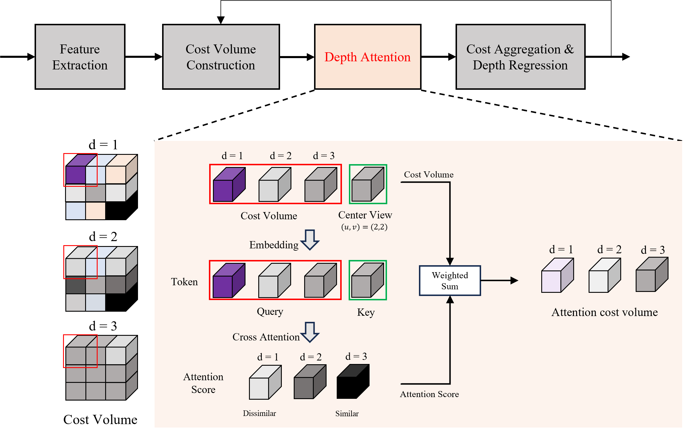
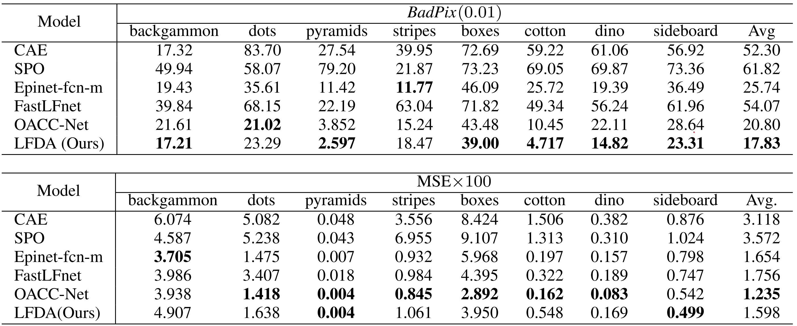
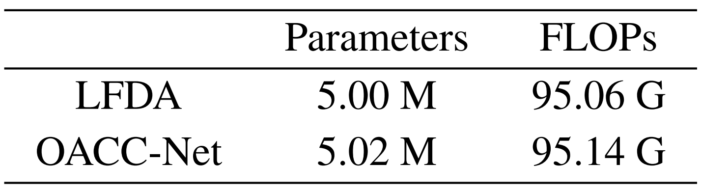
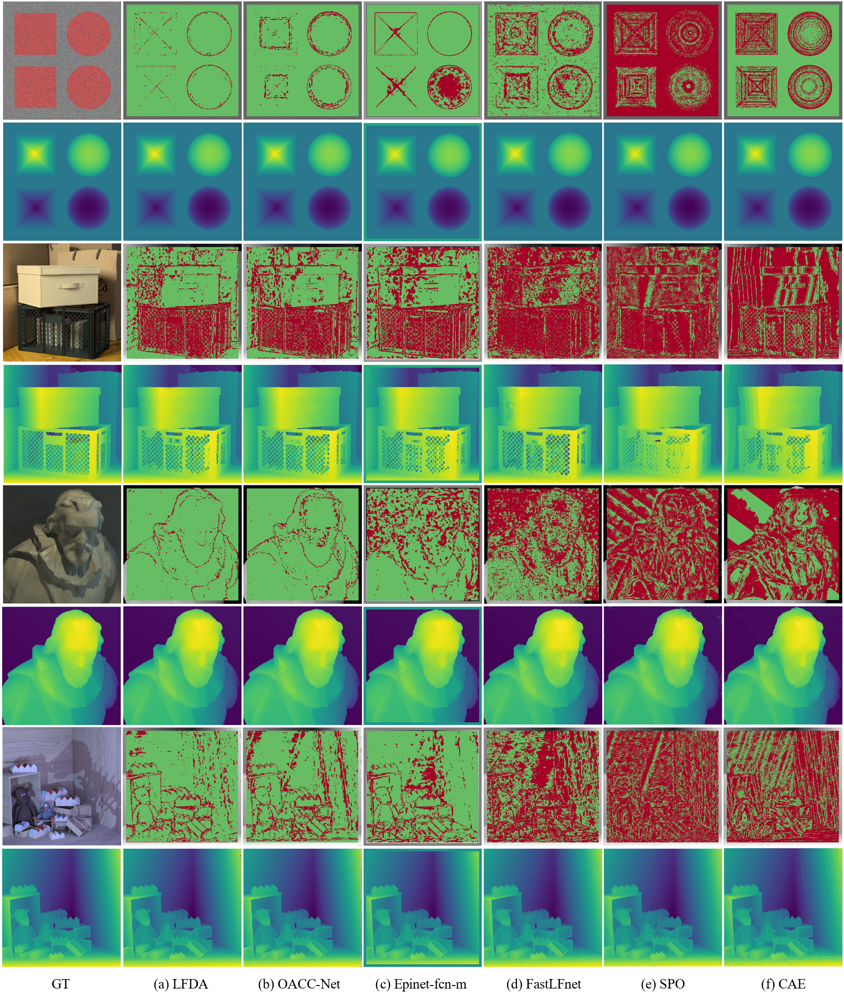

# LFDA (Light Field Depth Attention)


## Requirements

* Python == 3.8

+ Pytorch == 1.12.1

+ cuda == 10.2


`pip install requirements.txt`

## Dataset

+ We used a 4D Light Field Dataset for training and validation. Websites : https://lightfield-analysis.uni-konstanz.de/

+ Datset is there `./dataset/`

+ And if you want to train or test new Dataset, modify the `./dataset/training` folders, add your new datasets with GT

## Quick Start
You can set hyper-parameter(lr, epoch, ...) on function `argparser()` in each files
### Train

+ if you want to train for new data or modify and train LFDA model, refer to the following code.

```
python train.py
```

+ Checkpoints(`.pth`) will be saved to `./log` folder and per 10 epoch, saved Checkpoints, logs(`Model_Name_MSE100.txt`) 4 valid results(`depthmap.pfm`) `./Model_name/epoch`


### Test

+ if you want to test LFDA or your new model on 4D LF Datset, refer to the following code.

```
python test.py
```

## LFDA Results


### Params, Flops



### Visual Comparisons

## Contact

+ Welcome to raise issues or emaile to **32181265@dankook.ac.kr** for any question

## Reference

+ This code is modified and heavily borrowed from OACC-Net:
https://github.com/YingqianWang/OACC-Net

+ The code they provided is greatly appreciated.
